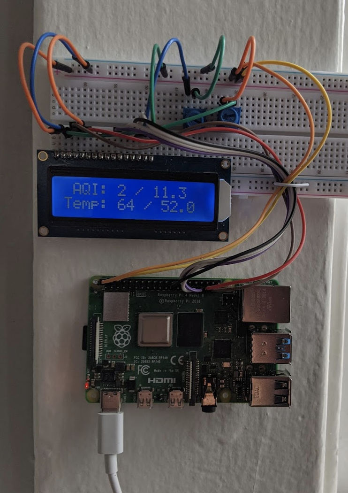

## Realtime PurpleAir Data Display

To run script and see current PM2.5 AQI and Temperature:

`bash run.sh`

To run continuously and print to console:

`bash run.sh repeat` 

To text alerts when AQI threshold is surpassed:

`bash run.sh repeat text`

Define your sensor number, air quality thresholds, and other options in `params.yaml`